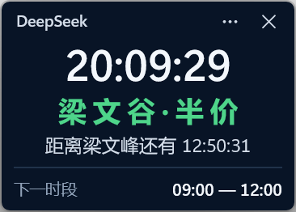
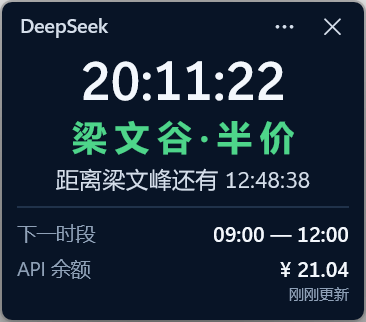
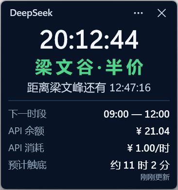
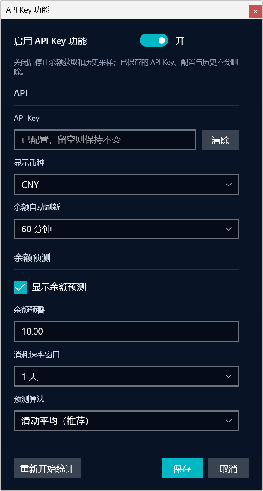

# LiangWenPeak

一个显示 DeepSeek API 峰谷价格状态的 Windows 桌面小工具。

LiangWenPeak 按北京时间显示当前是原价还是半价时段、距离下一次真实价格变化还有多久，并可选显示通知、API 余额、消耗速率和余额触底时间。它是非官方社区工具，与 DeepSeek 没有授权、维护或商业关系。

`LiangWenPeak = LiangWen + Peak`。中文界面相应显示“梁 文 峰 · 原 价”或“梁 文 谷 · 半 价”。

<table>
  <thead>
    <tr>
      <th>紧凑模式</th>
      <th>余额</th>
      <th>余额预测</th>
    </tr>
  </thead>
  <tbody>
    <tr>
      <td></td>
      <td></td>
      <td></td>
    </tr>
  </tbody>
</table>

  

## 功能

- 始终置顶的紧凑桌面窗口
- 按北京时间显示工作日峰谷价格状态与下一次真实变化
- 周末全天半价，不产生无效切换
- 可选的峰谷到达通知与提前提醒
- 可选的 DeepSeek API 余额查询
- 本地余额历史、消耗速率和余额触底预测
- 多币种余额、预警和预测
- Windows 11 Fluent Theme，可随时关闭
- Portable ZIP，无需安装

## 峰谷规则

所有规则均按北京时间（UTC+8）计算，与 Windows 当前系统时区无关。

| 日期 | 梁文峰 · 原价 | 梁文谷 · 半价 |
| --- | --- | --- |
| 周一至周五 | `09:00–12:00`、`14:00–18:00` | `00:00–09:00`、`12:00–14:00`、`18:00–24:00` |
| 周六、周日 | — | 全天 |

应用只显示真实的下一次价格变化。例如周五 `18:00` 之后，下一次峰价是周一 `09:00`。

## 下载与运行

LiangWenPeak 支持 Windows 10 / Windows 11 x64。

1. 从 [GitHub Releases](https://github.com/zeronx798/LiangWenPeak/releases/latest) 下载最新的 `LiangWenPeak-<version>-windows-x64.zip`。
2. 完整解压 ZIP。
3. 运行解压目录根部的 `LiangWenPeak.exe`。

请保持解压后的目录结构。移动应用时应移动整个目录，不要单独移动 Launcher、`current.txt` 或版本目录，也不要直接运行 `app-<version>/LiangWenPeak.App.exe`。

## 设置

从主窗口的 `···` 菜单打开“设置...”。普通设置只有点击“保存”后才会生效；“取消”会丢弃尚未保存的修改。

### API 与余额

API Key 是可选项。没有 API Key 时，峰谷状态、北京时间、倒计时和下一时段仍可正常使用。

- “启用 API Key 功能”控制余额查询和历史采样；关闭不会删除已保存的 Key、设置或历史。
- 已配置 API Key 时，输入框保持为空；留空并保存会保留原 Key。
- “清除”需要再次点击“保存”才会真正删除 Key，点击“取消”不会删除。
- 可选择显示币种、余额预警、自动刷新周期、消耗速率窗口和预测算法。
- 余额预测默认关闭，可选择滑动平均、指数平均或稳健趋势。
- 主菜单中的“刷新余额”会立即查询一次余额。

### 通知

通知默认关闭。启用后会在进入峰价或谷价时通知；提前提醒默认开启并提前 10 分钟，可设置为 `1–30` 分钟。

主菜单中的“启用通知”是立即生效的快捷开关。设置窗口中的通知选项则遵循“保存 / 取消”。“测试通知”始终可用，不要求先启用正式通知。

错过的提前提醒不会补发；价格切换后的“到了”通知最多在 15 分钟内补发一次。通知横幅是否显示还会受到 Windows 通知设置、专注模式和勿扰模式影响。

### 立即操作

- “重新开始统计”会在确认后归档当前余额历史，并从后续采样重新统计；旧历史不会删除。
- “测试通知”会立即尝试发送测试通知。
- “彻底清理”会在再次确认后清除应用保存的凭据、设置和通知系统集成信息。

这些操作不受设置窗口的“保存 / 取消”回滚。

### Fluent Theme

Windows 11 默认启用 Fluent Theme，可从主菜单关闭并记住选择。Windows 10 不显示该菜单项。

## 数据与隐私

- API Key 只用于请求 DeepSeek 官方余额接口，LiangWenPeak 没有自己的后台服务。
- API Key 和历史身份密钥保存在 Windows Credential Locker 中，不写入余额历史。
- 余额历史保存在 portable 目录的 `data/balance-history.csv`，归档位于 `data/history/`。
- 复制 portable 目录会同时复制其中的余额历史，但 Windows Credential Locker 中的 API Key 不会随目录迁移。
- 网络请求失败时会保留最近一次成功获取的余额，不会将余额重置为零。

“彻底清理”不会删除、清空、移动或改写 `data/`，包括 `balance-history.csv` 和 `history/`。如需删除本地余额历史，请在退出所有 LiangWenPeak 实例后自行处理这些文件。

## 更多文档

- [版本变化](CHANGELOG.md)
- [技术规格](docs/tech-specs.md)：运行时架构、通知实现、设置事务、存储模型、预测算法、测试隔离、构建与发布流程

## License

LiangWenPeak 使用 [Apache License 2.0](LICENSE) 开源。
