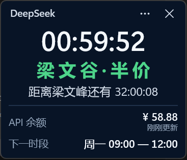

# LiangWenPeak

一个使用原生 C++20、C++/WinRT 和 WinUI 3 编写的 Windows 桌面峰谷价格状态小窗。

LiangWenPeak 根据北京时间显示 DeepSeek API 当前价格状态，并提供距离下一次真实价格变化的倒计时、下一时段和可选的 API 余额。它是一个非官方社区工具，与 DeepSeek 没有授权、维护或商业关系。



`LiangWenPeak = LiangWen + Peak`，是表达峰值时段的趣味命名。中文界面相应显示“梁 文 峰 · 原 价”或“梁 文 谷 · 半 价”。

## 功能

- 原生 C++20、C++/WinRT、WinUI 3 与 XAML
- 默认始终置顶的紧凑 Windows 桌面窗口
- 固定按北京时间（UTC+8）判断峰谷状态
- 工作日峰谷计价与周末全天半价
- 指向下一次真实价格变化的倒计时，支持超过 24 小时
- 下一价格时段显示
- 可选的 DeepSeek API 余额查询
- 可配置且对齐整分钟的余额自动刷新
- 使用 Windows Credential Locker（PasswordVault）保存 API Key
- 原生 Win32 Launcher
- Self-contained portable distribution
- 一条命令完成构建、测试、校验和打包

## 峰谷规则

所有规则均按北京时间（UTC+8）计算，与 Windows 当前系统时区无关。

### 周一至周五

| 状态 | 价格 | 时段 |
| --- | --- | --- |
| 梁文峰 | 原价 | `09:00–12:00`、`14:00–18:00` |
| 梁文谷 | 半价 | `00:00–09:00`、`12:00–14:00`、`18:00–24:00` |

### 周六、周日

周末全天为梁文谷半价。`09:00`、`12:00`、`14:00` 和 `18:00` 不会产生价格状态切换。

应用始终计算下一次真实变化。例如周五 `18:00` 进入低谷后，下一次峰值是周一 `09:00`。周末可能显示：

```text
梁 文 谷 · 半 价
距离梁文峰还有 32:27:38
下一时段  周一 09:00 — 12:00
```

## 下载与使用

从 GitHub Releases 下载最新的 Windows x64 portable ZIP，完整解压后运行根目录中的 `LiangWenPeak.exe`。发布文件使用以下命名格式：

```text
LiangWenPeak-<version>-windows-x64.zip
```

Launcher 和版本目录需要保持在一起；用户入口始终是解压目录根部的 `LiangWenPeak.exe`。

## API 余额与隐私

API Key 是可选项。未配置时，峰谷状态、北京时间、倒计时和下一时段仍然完整可用；配置后，应用通过 DeepSeek balance endpoint 查询余额：

```text
GET https://api.deepseek.com/user/balance
Authorization: Bearer <API_KEY>
```

余额支持手动刷新，并可选择 `1 / 5 / 10 / 15 / 30 / 60` 分钟的自动刷新周期。自动请求对齐实际时钟的整分钟 `00` 秒，网络失败不会把已有余额重置为零。

- API Key 仅用于调用 DeepSeek balance endpoint。
- LiangWenPeak 没有自己的后台服务，不会把 API Key 上传到项目自己的服务器。
- API Key 由 Windows Credential Locker（PasswordVault）保存。
- 完整 API Key 不会写入普通明文配置文件或应用日志。

LiangWenPeak 不统计 API Token 用量，也不提供消费历史或账单分析。

## Portable 结构

```text
LiangWenPeak/
├─ LiangWenPeak.exe
├─ current.txt
└─ app-<version>/
   ├─ LiangWenPeak.App.exe
   └─ ...
```

- `LiangWenPeak.exe` 是用户入口的原生 Win32 Launcher。
- `current.txt` 指定当前应用版本。
- `app-<version>/` 保存实际 WinUI 应用及 self-contained Windows App SDK runtime。

Portable 包包含 Windows App SDK、WinUI 3 runtime 和资源文件，因此体积明显大于 LiangWenPeak 自身的原生可执行文件。

## 从源码构建

正式 Release 的推荐入口是普通 PowerShell 中的一条命令：

```powershell
.\scripts\release.ps1
```

脚本自动发现构建环境和源码版本，然后执行依赖还原、clean build、tests、staging、内容校验、Launcher smoke tests 和 ZIP 打包。项目版本的唯一来源是 [`Version.props`](Version.props)。

日常开发可以使用 Visual Studio，或仅构建 Debug 版本：

```powershell
.\scripts\build.ps1 -Configuration Debug
```

### 开发环境

- Windows 10 或 Windows 11
- Visual Studio 2022 或 Build Tools 2022
- `使用 C++ 的桌面开发`工作负载与 MSVC v143
- 与项目 target 匹配的 Windows 10/11 SDK
- PowerShell
- NuGet 依赖还原所需的网络访问

当前构建脚本提供 `windows-x64` 目标。

### 构建脚本

| 脚本 | 职责 |
| --- | --- |
| [`scripts/build.ps1`](scripts/build.ps1) | 发现工具链、还原依赖并构建解决方案 |
| [`scripts/package.ps1`](scripts/package.ps1) | 创建并校验 portable staging layout 与 ZIP |
| [`scripts/release.ps1`](scripts/release.ps1) | 从 clean state 执行完整 Release 流程 |

## 项目结构

```text
src/                 应用、核心逻辑和 Launcher
tests/               核心、Launcher、构建与 UI 测试
scripts/             构建、打包、发布与 UI 验证脚本
docs/images/         README 正式图片
Version.props        项目版本的唯一来源
CHANGELOG.md         版本记录与 GitHub Release 内容
LICENSE              Apache License 2.0
```

版本变化与发布产物信息见 [CHANGELOG.md](CHANGELOG.md)。

## License

LiangWenPeak 使用 [Apache License 2.0](LICENSE) 开源。
